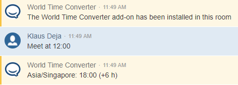

# World Time Converter for HipChat

This is a Hipchat integration, which sends a message to a room once he notices a message in the format of *hh:mm*. It
will convert the input time into specific timezone formats, displaying the offset from the user timezone.
The target timezones are configurable trough the integration config.

## Usage

To install the integration, use the URL `https://world-time-hipchat.herokuapp.com` as addon descriptor in your HipChat instance. The integration is currently not available through the Atlassian store.

